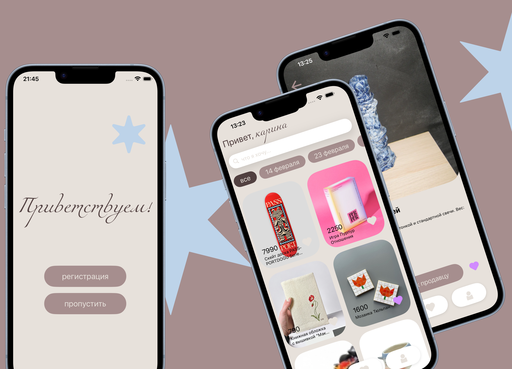

  

# SURPRISE 🎁
 
> мобильное приложение для подбора подарков под iOS — никогда больше не зависай в магазине, гадая, что подарить
 
# Содержание
 
- [Главный экран — Лента](#главный-экран--лента)
- [Карточка товара](#карточка-товара)
- [Избранное](#избранное)
- [Профиль](#профиль)
- [Авторизация и онбординг](#авторизация-и-онбординг)
- [Архитектура и стек технологий](#архитектура-и-стек-технологий)
- [Как попробовать](#как-попробовать)

## Главный экран — **Лента**
 
Главный экран приложения. Показываются персонализированные подборки подарков, разбитые по категориям. Сверху — приветствие, ниже — поиск, чипсы категорий и сама лента.
 
- лента из карточек с картинкой, названием и ценой
- горизонтальные чипсы для быстрой фильтрации по категории
- поиск по названию и описанию
- лайк прямо из ленты — нажатие на «сердце»
- свайп вниз → автоподгрузка следующей страницы
  

    

## Карточка товара
 
Это экран с детальной информацией. Можно увидеть подробное описание, цену, магазин, и сразу перейти к покупке у внешнего продавца.
 
- увеличенное изображение подарка
- полное описание (с раскрытием по тапу, если длинное)
- цена и информация о магазине
- кнопка «к продавцу» — открывает страницу товара во внешнем магазине
- большая кнопка избранного снизу справа
  

    

## **Избранное**
 
Все подарки, которые лайкнул, на одном экране. Можно вернуться сюда позже, когда появится желание купить.
 
- сетка карточек, отсортированная по дате добавления (свежее сверху)
- удаление из избранного одним тапом
- переход к деталям подарка из любой карточки
- если в избранном пусто — мягкий пустой экран с подсказкой
- работает офлайн через Core Data

    

## **Профиль**
 
Тут хранится твоя личная информация и настройки приложения.
 
- просмотр и редактирование имени, email, номера телефона
- выбор аватара (две встроенные звезды — голубая и розовая)

    

## Авторизация и онбординг

Сначала показывается приветсвенное окно — выбор: войти, зарегистрироваться или продолжить как гость.
Первый запуск проводит через 3-страничный онбординг, объясняющий, что умеет приложение. 
 
- регистрация по email или номеру телефона
- вход в существующий аккаунт по email/телефону + пароль
- гостевой режим — для тех, кто не хочет регистрироваться
- автоматическое обновление access-токена через refresh-токен (фоновая ротация)
- безопасное хранение токенов в Keychain через `AuthManager`

    

## Архитектура и стек технологий
 
### iOS-клиент
 
- **Язык:** Swift 
- **UI-фреймворк:** UIKit
- **Архитектура:** MVVM + Coordinator
- **Локальная БД:** Core Data (для офлайн-режима — каталог подарков, избранное)
- **Сеть:** URLSession + async/await; своя обёртка `NetworkService` с автоматическим refresh JWT и единой обработкой ошибок
- **Минимум:** iOS 18.6
- **Аналитика:** AppMetrica (Yandex)
Поток данных: `ViewController → ViewModel → Repository → DataSource (Remote / Local)`. Coordinator-слой управляет навигацией и не знает про конкретные ViewController'ы напрямую.
 
### Backend
 
- **Язык:** Python 3.10+
- **Веб-фреймворк:** FastAPI
- **Сервер:** Uvicorn + Uvloop (ASGI, async)
- **БД:** PostgreSQL 16
- **ORM:** SQLAlchemy 2.0 (async)
- **Драйвер БД:** asyncpg
- **Миграции:** Alembic — 6 ревизий с data-migration (нормализация `categories` из строки в M2M, добавление `gift_images`, переход на `TIMESTAMPTZ`, etc.)
- **Auth:** JWT (python-jose), refresh-токены
- **Хэширование паролей:** pbkdf2_sha256 (passlib)
- **Валидация:** Pydantic 2 (DTO с серверной валидацией формата email/phone)
Архитектура слоистая: `routers → services → repositories → models`. ORM-модели нормализованы по третьей нормальной форме: `Category` ↔ `Gift` через M2M, `GiftImage` отдельной таблицей с partial unique-индексом для обложки, `favorites` с `created_at` для офлайн-синка.
 
### Инфраструктура
 
- **Хостинг:** Ubuntu 22.04 LTS VPS
- **Service runtime:** systemd (`surprise.service`)
- **Reverse proxy:** nginx (порт 80 → uvicorn :8000)
- **PostgreSQL:** системный пакет на сервере, Docker Compose локально
- **Распространение iOS:** TestFlight (App Store Connect)

## Как попробовать
 
iOS 18.6+, любой iPhone от A12 Bionic.
1. Установить **TestFlight** из App Store (если ещё нет)
2. Перейти по ссылке TestFlight — [Приложение](https://testflight.apple.com/join/GXTNJXu8)
3. В TestFlight нажать **Установить SURPRISE**
4. Открыть приложение, пройти онбординг, выбрать гостевой режим или зарегистрироваться
